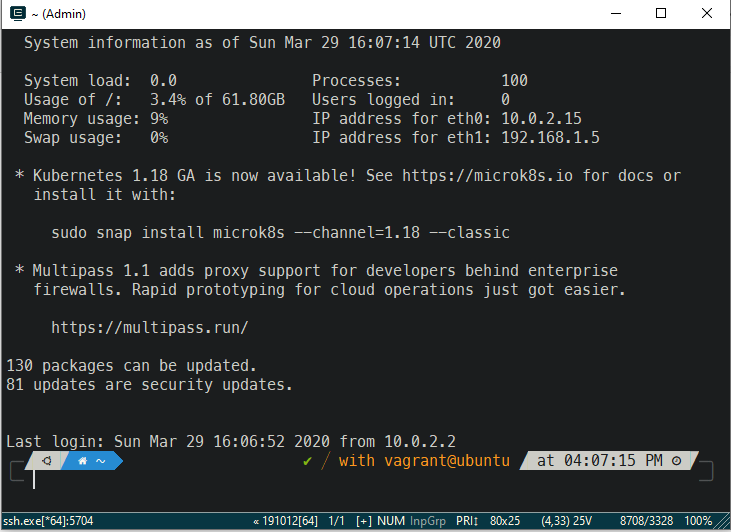
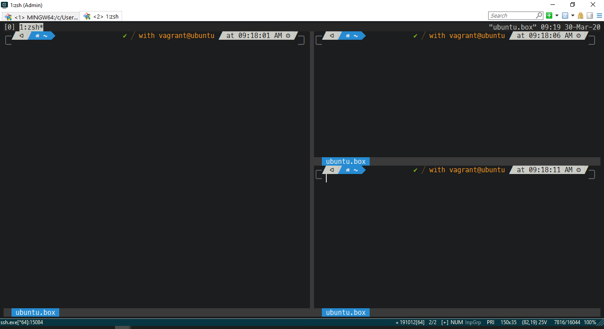

# Ubuntu-18.04-cert-manager-dev-box
This vagrant box is a development environment required to build and e2e test cert-manager.

## Packages installed
* zsh, oh-my-zsh, powerlevel10k, autocompletion plugin
* tmux, looks customised
* kubectl
* nodejs
* helm
* ansible
* bazel
* docker
* kind with k8s
* pip python3

## Known issues
* The rc file for vim installed in the box has some reference to uninstalled vim plugins. When vim is opened, error about the missing plugin show up. How ever this error will not block the usage of vim

## Prerequisite
You need the following installed on host machine
* VirtualBox 5.2.38 
* Vagrant 2.2.7
* git bash /conemu
* configure the termial emulater to use the font MesloLGS NF(Provided in asset folder of this repo )

## How to create a guest vm box
* git clone https://github.com/patilvinay/ubuntu-18.04-cert-manager-dev-box.git
* cd ubuntu-18.04-cert-manager-dev-box
* vagrant up
* vagrant ssh

Once you 'vagrant ssh' you can login to the virtual machine. 
>username: vagrant  
>password: vagrant

# Build the cert-manager 
* git clone https://github.com/jetstack/cert-manager.git
* cd cert-manager
* git checkout release-0.15
* [build instructions](https://github.com/jetstack/cert-manager/tree/master/devel)

## vm zsh looks like this

## vm tmux looks link this

